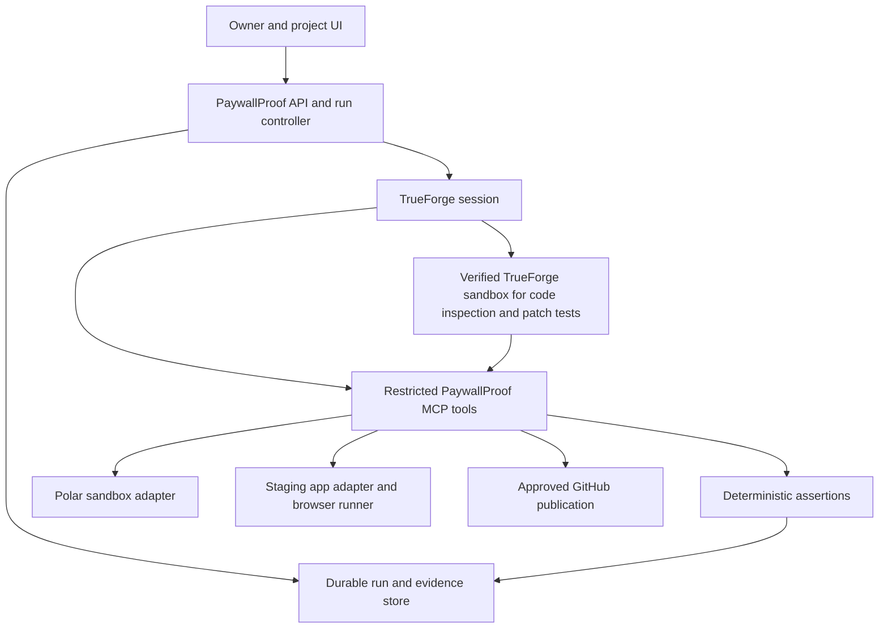

# PaywallProof

## Product requirements and implementation specification

Version: 2.4
Updated: August 30, 2026
Owner: Vasu
Status: Reference-target repair and second-target lifecycle evidence are complete. The Adapter Doctor changes count as final development evidence only when the exact head of [PR #6](https://github.com/VasuBansal7576/PaywallProof/pull/6) passes CI and Qodo review. GitHub records the authoritative review status.

> Check whether your SaaS gives the right people access to paid features. Reproduce failures, show the evidence, and propose a tested repair.

### How to read this document

For the product, read sections 1 through 4. For implementation, read sections 5 through 14 and the owner constraints in section 17. A coding agent must not treat a proposed interface as an existing SDK feature. [Verification status](docs/verification.md) records executed results. [Implementation decisions](docs/decisions.md) records changes to the original plan.

This document is the source of truth for the hackathon MVP. **MUST** means required for that MVP. **SHOULD** means preferred unless a documented constraint prevents it. **LATER** means outside the MVP. A blocked requirement stays visible. It does not become complete because a demo uses a substitute.

### Contents

- [Product and customer](#1-product-and-customer)
- [Scope and decisions](#2-scope-and-decisions)
- [User journey and interface](#3-user-journey-and-interface)
- [Product requirements](#4-product-requirements)
- [Access policy and result rules](#5-access-policy-and-result-rules)
- [Scenario catalogue](#6-scenario-catalogue)
- [Architecture and ownership](#7-architecture-and-ownership)
- [Domain model and persistence](#8-domain-model-and-persistence)
- [Integration contracts](#9-integration-contracts)
- [TrueForge and Qodo integration](#10-trueforge-and-qodo-integration)
- [Safety and permissions](#11-safety-and-permissions)
- [Recovery, limits, and cleanup](#12-recovery-limits-and-cleanup)
- [Repair workflow](#13-repair-workflow)
- [Verification and acceptance](#14-verification-and-acceptance)
- [Commercial assumptions and unresolved risks](#15-commercial-assumptions-and-unresolved-risks)
- [Sources](#16-sources)
- [Owner constraints and independent verification](#17-owner-constraints-and-independent-verification)

## 1. Product and customer

### 1.1 The problem

A successful payment does not prove that the customer can use the product. A canceled subscription does not prove that the application removed access. Polar, the application's stored billing state, and its authorization code can disagree.

The founder often tests the happy path by buying a plan and seeing a success page. Failures can remain in the webhook handler, user mapping, cached session, or server-side access check.

One concrete example is an August 20, 2026, production reconciliation in Kortix/Suna. The team's merged PR reports canceled Stripe subscriptions still recorded as active locally. A forthcoming access change would have made those stale records dangerous. This is evidence of a failure class, not proof of revenue lost or a market-size estimate. [Source](https://github.com/kortix-ai/suna/pull/6669)

### 1.2 The customer

The first customer is an independent SaaS founder or a small engineering team that owns a TypeScript application and uses Polar subscriptions. They can supply a staging environment, test credentials, and the rules for a paid feature.

Their immediate question is: "Can a free user get this feature, and will a paying user actually receive it?"

The initial trigger is a launch or a change to billing, authentication, or feature access. Repeated checks on pull requests are a later distribution option.

### 1.3 The product promise

Given an authorized staging application, a Polar sandbox, and an approved access policy, PaywallProof:

1. Creates isolated test users and subscription states.
2. Exercises a real protected feature through its API and user interface.
3. Compares observed behavior with the approved policy.
4. Produces reproducible findings with evidence.
5. For a trusted repair profile, proposes a repair in a disposable checkout, tests it, and requests permission to publish a PR.

The report describes the scenarios actually tested. It MUST NOT say that an application is fully secure, that billing is certified, or that every subscription edge case is covered.

### 1.4 Why an agent belongs here

For a trusted repair profile, the agent reads the application's relevant code, explains disagreements, and drafts a repair that fits the repository. For every contract-v1 target, the target declares one bounded feature descriptor and Adapter Doctor validates it before the run; the model does not invent routes or selectors.

Deterministic code owns resource permissions, scenario execution, expected access, evidence validation, and verdicts. The model cannot decide that a failed check passed or authorize its own actions.

Existing tools already automate checkout tests. PaywallProof's proposed focus is the agreement between a founder's access policy and the real protected feature. This positioning still needs customer validation. [Existing checkout-testing example](https://getautonoma.com/blog/how-to-test-stripe-checkout)

## 2. Scope and decisions

### 2.1 Fixed MVP decisions

| Decision                 | MVP choice                                                                                            | Reason                                                                       |
| ------------------------ | ----------------------------------------------------------------------------------------------------- | ---------------------------------------------------------------------------- |
| Billing provider         | Polar sandbox only                                                                                    | Supports real test objects and subscription simulations without moving funds |
| Account model            | One isolated Polar sandbox organization                                                               | Bind organization, product, price and run-owned resources                    |
| Application              | Contract-v1 owned staging targets; repair limited to the bundled Next.js reference profile            | Separates reusable lifecycle checks from target-specific source repair       |
| Plans                    | Free and one monthly Pro plan                                                                         | Sufficient to expose incorrect grants and incorrect denials                  |
| Protected feature        | One real API-backed feature                                                                           | Gives the checker an observable outcome                                      |
| Authentication           | Ordinary test-user sessions through a staging adapter                                                 | Admin credentials must not influence access probes                           |
| Test control             | One run at a time per project                                                                         | Avoid conflicting fixtures, patches, and period changes                      |
| Agent runtime            | TrueForge, with the official TypeScript SDK                                                           | Required by the hackathon                                                    |
| Generated-code execution | TrueForge's verified local sandbox provider, or Daytona with independently confirmed no-charge access | Preserve generated-code isolation and verify the actual runtime boundary     |
| Development review       | Qodo on every substantive GitHub PR                                                                   | Required by the hackathon                                                    |
| Product deployment       | Single operator, local/private control interface                                                      | Public multi-tenant operation is outside the MVP                             |
| Finding publication      | Local report first, GitHub PR only with approval                                                      | A scan must remain useful without write permission                           |

Polar's test infrastructure does not move funds. TrueForge's sandbox documentation describes Daytona; its pinned 0.1.4 release also supplies a local provider based on sandbox-runtime. The local option adds a permitted provider without removing sandbox execution, credential separation, network isolation, or acceptance requirements. Installation probes alone do not complete product acceptance. See [the provider decision and evidence](docs/decisions.md). [Polar](https://polar.sh/docs/integrate/sandbox) · [TrueForge](https://trueforge.dev/sandbox)

### 2.2 What the MVP includes

The MVP MUST include connection checks, policy approval, the core scenario suite, actual API and browser evidence, human-readable findings, reconnectable runs, and, for the trusted reference profile, a bounded repair attempt and approved PR publication path.

The target application MUST expose the small staging adapter defined in section 9. Implement the reference adapter for the bundled demo application. A second owned application SHOULD be connected before claiming useful portability.

"Connect any GitHub repository and it works" is not an MVP promise. Unsupported applications receive an explicit adapter requirement, not a fabricated scan.

### 2.3 Explicit exclusions

The MVP does not support production scans, real charges, refunds, tax calculations, discounts, metered billing, credits, multiple subscriptions per user, team-level entitlements, multiple currencies, disputes, or Polar Connect.

The MVP does not automate Polar's hosted card-entry UI. The authenticated operator flow exposes a sandbox checkout link for completion with official test payment details. Automation then observes the resulting subscription, paid initial order and feature access. It does not claim to test checkout form usability. The report MUST state this coverage limit.

The MVP does not include a universal vulnerability scanner, a generic test-generation platform, automatic merging, automatic production deployment, or repairing production account data.

Trials, failed-payment grace periods, upgrades, downgrades, event reordering, duplicate delivery, and CI scheduling are LATER. They appear in the extension catalogue so agents do not accidentally implement them before the core works.

## 3. User journey and interface

### 3.1 Connect a project

The owner selects a repository and commit, enters the staging origin, and selects server-configured Polar and adapter connections. Secrets never go into chat. The owner identifies one paid feature and confirms ownership of the target.

Before source inspection, show which model provider will receive the selected code and sanitized observations. Obtain consent for that data processing. Repository read permission alone is not permission to send unrelated private files to a model.

The server verifies connectivity, account identity, adapter capabilities, repository access, and the absence of live Polar mode. A missing prerequisite produces a specific action such as "Configure a reachable webhook endpoint".

The owner can first open a clearly labeled bundled demo. Demo data and a real connected application must never look interchangeable.

### 3.2 Confirm what customers should receive

The agent proposes a policy from the relevant code and configuration. The interface asks the owner to confirm:

- Which Polar price grants Pro access.
- Which protected feature represents that access.
- Whether scheduled cancellation preserves access until the paid period ends.
- How long the app is allowed to take to reflect a billing change.

The MVP preset preserves access until period end. If the owner requires a different rule, mark that policy unsupported instead of silently applying the preset.

Show the test plan and its permitted side effects before execution. Approval authorizes a bounded set of new test objects and changes to those objects. It does not authorize changes to existing customers.

### 3.3 Watch the run

The run screen shows a short task timeline, not a wall of model reasoning:

| Stage          | Example visible message                                              |
| -------------- | -------------------------------------------------------------------- |
| Preparing      | "Creating run-owned users and a Polar sandbox customer"              |
| Waiting        | "Polar has canceled the subscription. Waiting for the app to update" |
| Checking       | "Calling the protected export endpoint as the canceled user"         |
| Finding        | "The export succeeded, but the approved policy requires denial"      |
| Needs approval | "Publish this tested patch to a new branch?"                         |
| Blocked        | "The webhook endpoint is unreachable. Access could not be evaluated" |

The user can stop the run. Reloading the page reconnects to the same run. It MUST NOT create another subscription or start another agent turn just to restore the display.

### 3.4 Read a finding

Each finding answers five questions: what should have happened, what happened, how it was observed, how to reproduce it, and what remains uncertain.

Example, illustrative only:

> A canceled test user can still export Pro data.
>
> Expected: the export endpoint denies access after the confirmed cancellation reaches the application deadline.
>
> Observed: Polar reports canceled, the application's billing snapshot still reports active, and the export endpoint returns the run's protected fixture data.
>
> Evidence: subscription snapshot, application snapshot, request and response, and browser screenshot.
>
> Suspected cause: the webhook handler does not process subscription deletion. This diagnosis requires code inspection; the observed access mismatch is already proven.

Do not present a suspected code location as a verified root cause until a repair removes the failure under the same test.

### 3.5 Review and publish a repair

The owner selects **Prepare repair**. The agent edits an isolated checkout and runs the original failing test plus regression checks. The interface shows the diff, changed files, test evidence, and limitations.

Because the original run is already terminal, this explicit request starts a separate local repair job with its own persisted 15-minute active-execution limit. It reuses the run's TrueForge session but does not renew its expired billing authorization or mutate its original fixtures. Restarting the worker does not reset the repair job's deadline. Publication approval is a separate, expiring decision after verification.

The owner separately approves **Publish PR**. Publishing does not merge the PR or deploy the change. The original staging run stays failed until a new run verifies the changed staging deployment.

### 3.6 Screen inventory

| Screen             | Required content                                                                                  |
| ------------------ | ------------------------------------------------------------------------------------------------- |
| Project setup      | Connections, target identity, capability checks, ownership confirmation                           |
| Policy and plan    | Plain-language rules, feature mapping, permitted side effects, approve or cancel                  |
| Run                | Scenario rows, progress, period boundary, elapsed time, stop, reconnect status, pending approvals |
| Finding and repair | Expected and actual behavior, evidence, reproduction, diff, checks, publication state             |

Use text and icons as well as color. Keep controls keyboard accessible. Collapse raw traces by default. Show "Untested", "Inconclusive", and "Blocked" as distinct labels.

### 3.7 Human and agent workspace

The operator UI uses a dark navigation rail, light working area and green action accent. All existing project, policy, approval, scenario, finding, evidence, report and repair controls remain available. The redesign does not remove product scope.

- Show the latest run by its recorded creation timestamp, not by API array position. Count only saved records; do not invent activity or evidence.
- Search the entire run history by project name, full run identifier and build. Combine search with result or attention filters. The review queue includes pending plans, failed runs and inconclusive runs.
- Preserve all project and recent-run navigation on narrow screens. The menu must expose its expanded state, close with Escape and return focus to its trigger. Run status and execution mode remain visible in mobile history rows.
- Run tabs have stable `#scenarios`, `#findings`, `#evidence`, `#report`, `#activity` and `#repairs` links. Arrow keys, Home and End change tab focus; reload and browser history restore the selected tab.
- Offer full identifiers and recorded JSON through labeled copy controls. Report downloads must retain the same run, mode, policy and observations displayed in the UI. Clipboard failure must say so rather than report success.
- Keep approvals, local-replay limitations, runtime failures and cleanup receipts explicit. A generated candidate never becomes verified merely because the UI can display its source.

UI verification covers the real local workspace plus separately intercepted, nonpersistent presentation fixtures for empty states, large histories, hostile names, worker-read failures and recovery. Presentation fixtures cannot authorize writes or count as product evidence.

## 4. Product requirements

| ID  | Requirement                                                                                          | Completion evidence                                                 |
| --- | ---------------------------------------------------------------------------------------------------- | ------------------------------------------------------------------- |
| R01 | Verify target ownership, connection identity, adapter capability, and Polar sandbox before mutations | Preflight report with explicit failures and no writes on failure    |
| R02 | Save an immutable, owner-approved policy and plan                                                    | Policy hash and approval attached to every run                      |
| R03 | Create only isolated test fixtures with recorded ownership                                           | Resource inventory maps every created object to a run               |
| R04 | Execute the core lifecycle scenarios against real Polar test objects                                 | Polar receipts and application observations for SC01 through SC04   |
| R05 | Probe the protected API as a normal user and verify browser behavior                                 | User-scoped API evidence and screenshots, with no admin bypass      |
| R06 | Compute verdicts from deterministic predicates                                                       | Unit tests reject missing, stale, or contradictory evidence         |
| R07 | Keep the runtime and run display recoverable                                                         | Reconnect test does not duplicate external actions                  |
| R08 | Respect approvals, cancellation, and execution limits                                                | Denied and expired approvals cause no new write                     |
| R09 | Produce a useful report without requiring repository write access                                    | Downloadable Markdown and JSON report                               |
| R10 | Prepare a bounded patch and retest it in isolation                                                   | Diff hash, before and after evidence, and regression results        |
| R11 | Publish a PR only after approval of the exact patch and destination                                  | PR URL verified by a subsequent provider read                       |
| R12 | Clean up only run-owned fixtures and disclose leftovers                                              | Cleanup receipts or a precise unresolved-resource list              |
| R13 | Use TrueForge for real tool orchestration, sandbox work, approvals, and session continuation         | Runtime trace and integration tests                                 |
| R14 | Carry a meaningful Qodo development review trail                                                     | Public merged PR, decisions, and review against final code          |
| R15 | Disclose coverage, execution mode, versions, and limitations                                         | Report distinguishes live sandbox, local replay, and untested cases |
| R16 | Remain usable on a passing application and when infrastructure fails                                 | Known-good, known-bad, and unavailable-target acceptance tests      |

## 5. Access policy and result rules

### 5.1 Three separate sources

PaywallProof compares three things without treating them as interchangeable:

1. **Expected access:** a pure function of the approved policy and a fresh, independently retrieved Polar snapshot.
2. **Stored application state:** the application's billing projection, read through the staging adapter. This helps diagnose drift.
3. **Observed access:** a request to the real protected endpoint and an interaction through the ordinary application UI.

The model's explanation, the application's plan label, and a webhook's HTTP 200 response cannot substitute for observed access.

The evaluator accepts observation IDs from the authoritative store, never model-supplied replacement payloads. Validate that every observation belongs to the same run, scenario, user, policy, and target build. Collect the final Polar and application snapshots within the same final probe cycle, normally within ten real seconds. If that interval is exceeded, collect fresh observations or return inconclusive.

### 5.2 MVP policy

The owner approves these rules for one Pro price and one feature:

| Condition                                                                                   | Expected protected access       |
| ------------------------------------------------------------------------------------------- | ------------------------------- |
| Authenticated user has no subscription                                                      | Deny                            |
| Subscription for the configured price is active and the initial order is paid               | Allow                           |
| That subscription is active with cancellation scheduled for period end, before the boundary | Allow                           |
| That subscription has reached its cancellation boundary and Polar confirms canceled         | Deny                            |
| Subscription status, payment state, identity mapping, or time basis cannot be resolved      | Unknown, not deny and not allow |

Unknown cases produce `inconclusive` or `unsupported`, as defined below. The checker must not copy the target application's entitlement function as its oracle.

The configured price, feature predicate, cancellation rule, and synchronization deadline are part of the policy hash. Changing any of them requires a new policy approval and a new run.

Compute the policy hash from canonical normalized JSON, excluding the hash field itself and approval metadata. Freeze predicate versions and referenced feature configuration in that input. A policy cannot change indirectly through a mutable configuration reference.

Check the target's build identity before each scenario and before the final probes. If the deployed build changes during a run, stop the affected comparison with `TARGET_CHANGED` and start a new run after approval. Do not compare evidence across two deployments as though it came from one version.

### 5.3 Timing

Record real observation time and the provider's actual period boundary. Polar has no Stripe-style accelerated test clock. The trusted adapter shortens the active subscription's real billing period before SC02, confirms that change by reading it back, and freezes that boundary through SC04. Never move the host clock or revoke immediately to impersonate period-end cancellation.

The target uses current provider status and normal signed webhook processing. Local replay may advance only its explicitly synthetic billing timeline. Browser authentication always uses real time. Unsupported app-time dependencies remain `unsupported`.

The default application synchronization window is 60 real seconds after Polar confirms the required state. The owner can approve 5 through 300 seconds before a run. A passed time boundary alone does not prove the provider or application completed its transition. After synchronization expires, repeat a final contradiction once before recording failure. Missing provider facts or an unreachable target remain inconclusive.

### 5.4 Verdicts

Assertions use exactly these verdicts:

| Verdict        | Meaning                                                                             |
| -------------- | ----------------------------------------------------------------------------------- |
| `pass`         | Required evidence is fresh, complete, correctly scoped, and satisfies the predicate |
| `fail`         | A supported expectation and trustworthy observations contradict each other          |
| `inconclusive` | The scenario ran, but evidence cannot establish an outcome                          |
| `unsupported`  | A required capability or policy is outside the implemented contract                 |
| `skipped`      | The scenario was not attempted, with a recorded reason                              |

Run outcome is `failed` if any assertion fails, `inconclusive` if any required assertion lacks a pass and none fails, and `passed` only if every required assertion passes. Always show counts and coverage beside the outcome.

An application-state mismatch and an access mismatch are separate assertions. A stale local status with correct API access is state drift, not a proven access leak. Incorrect UI visibility is a UI mismatch, not proof that the backend allows the operation.

Severity is based on the observed behavior. Incorrect protected access is high. Incorrect denial to a verified paying user is high. A display mismatch or non-exploited state drift is medium. Do not invent financial loss estimates.

## 6. Scenario catalogue

### 6.1 Required core suite

The first implementation uses an API-backed Pro export. The allowed response contains a run-specific fixture marker. A denial must follow the target adapter's approved response contract and must not contain protected data. HTTP 200 alone never proves success.

| ID   | Setup and action                                                                                                                                                  | Expected result                                                                          | Required observations                                                                    |
| ---- | ----------------------------------------------------------------------------------------------------------------------------------------------------------------- | ---------------------------------------------------------------------------------------- | ---------------------------------------------------------------------------------------- |
| SC01 | Create an authenticated free test user with no subscription; request the Pro feature                                                                              | API denies; UI offers upgrade or denies the action                                       | Identity receipt, no-subscription baseline, API response, UI evidence                    |
| SC02 | Create a run-owned sandbox customer; link it to a fresh app user; complete one paid monthly sandbox checkout, then shorten its real period before collecting SC02 | After confirmed active status and paid initial order, API allows; UI can use the feature | Polar customer/subscription/initial order, application snapshot, API marker, UI evidence |
| SC03 | Set `cancel_at_period_end` on SC02's subscription; check access before the period boundary                                                                        | Access remains available while the paid period continues                                 | Fresh subscription and observation time, application snapshot, API and UI evidence       |
| SC04 | Wait beyond the recorded real period boundary and require Polar to confirm cancellation                                                                           | After the synchronization window, API denies and UI reflects loss of access              | Real boundary crossed, canceled subscription, application snapshot, API and UI evidence  |

SC02 through SC04 are an ordered lifecycle on one customer. If an earlier state cannot be established, mark later scenarios skipped with the blocking dependency. Do not reuse these mutated fixtures for a rerun. Create a new lifecycle.

Scheduling cancellation and reaching cancellation are different states. Polar emits `subscription.canceled` when cancellation is scheduled and `subscription.revoked` when access ends. The event name alone never determines access; reconcile current subscription and order state. [Documentation](https://polar.sh/docs/features/subscriptions/manage)

### 6.2 Polar execution details

Use only `https://sandbox-api.polar.sh/v1`, pinned API `2026-04`, and verify `X-Polar-Sandbox: 1` plus the response version on every successful response. Disable redirects. Verify the organization and one positive fixed monthly catalog price with no trial, discount, meter or additional price.

Create one customer using an explicitly authorized test mailbox, immutable `external_id=paywallproof:<runId>` and run metadata. Never infer permission to transmit a private mailbox from a sign-in. Create a checkout for the configured product and that customer. Its URL must use `https://sandbox.polar.sh/checkout/`. Keep the private checkout URL out of tool results, logs and reports; expose it only to the authenticated operator. Use only documented test payment details. No live card, bank details or payment collection is permitted.

A succeeded checkout is not sufficient. Read the unique run-owned subscription and its exact initial `subscription_create` order. Require positive paid status, matching checkout/customer/subscription/product/currency and price amount, no discount, refund or applied balance, and no truncated pagination. Renewals cannot substitute for the initial payment.

Before SC02, set `current_billing_period_end` to a bounded future instant and read it back. Then collect paid access, schedule `cancel_at_period_end`, collect preserved access before that same boundary, and wait for real expiry and provider cancellation. Never change the frozen period during SC03 or SC04. See [subscription management](https://polar.sh/docs/features/subscriptions/manage).

The target's real `/api/polar/webhook` must receive Polar events and verify Standard Webhooks over exact body bytes and the delivery ID/timestamp/signature headers. A local listener or authorized HTTPS tunnel must deliver actual provider events. Local signed replay cannot replace delivery verification. See [sandbox](https://polar.sh/docs/integrate/sandbox) and [local webhook forwarding](https://polar.sh/docs/integrate/webhooks/locally).

### 6.3 Extension scenarios, not MVP requirements

| ID   | Later scenario                                             | Additional capability required                                  |
| ---- | ---------------------------------------------------------- | --------------------------------------------------------------- |
| EX01 | Duplicate delivery does not repeat a grant or notification | Delivery control and a meaningful side-effect counter           |
| EX02 | An old event cannot restore access after cancellation      | Ordered capture and replay, plus current-state reconciliation   |
| EX03 | Trial expiry changes access correctly                      | An approved trial policy and equivalent billing time in the app |
| EX04 | Failed renewal follows the owner's grace-period rule       | Invoice failure simulation, recovery settings, and grace policy |
| EX05 | Upgrade and downgrade change individual features           | Multiple price mappings and proration policy                    |

Polar does not guarantee event delivery order, and duplicate deliveries can occur. Do not implement simplistic deduplication by subscription ID plus event type, which would discard legitimate later updates. [Webhook behavior](https://polar.sh/docs/integrate/webhooks/delivery)

If extensions use synthetic replay, label the evidence `local_replay`. It does not prove Polar delivered the replayed event. Preserve signature verification on real webhook paths.

## 7. Architecture and ownership

### 7.1 System structure



### 7.2 Technology choices

Use a pnpm TypeScript workspace. Use Next.js for the product UI and API, a separate Node process for the MCP server and durable run worker, Zod for boundary validation, Vitest for unit and integration tests, and Playwright for browser checks.

Use SQLite for PaywallProof's single-operator control data. The reference target uses its own separate database. Its storage engine is hidden behind the staging adapter; it must not share control tables or secrets with PaywallProof.

A minimal Next.js demo with SQLite is sufficient for the reference target. PostgreSQL support is an adapter extension, not a reason to build a database abstraction framework.

Use the pinned Polar HTTP contract and `standardwebhooks` for native signatures, plus the official `@truefoundry/trueforge-sdk`. Commit the lockfile and record provider API, signing library, TrueForge versions and target commit in each run.

### 7.3 Module responsibilities

The run controller owns durable state, approval validation, operation identity, deadlines, and single-run locking. It does not implement a second LLM agent loop. TrueForge owns model turns, tool orchestration, runtime approval pauses, and the sandbox.

The restricted MCP service owns credentials and validates every tool call. It exposes typed operations, not arbitrary SQL, arbitrary HTTP requests, or a shell with billing credentials.

The core package is pure. It receives typed snapshots and returns verdicts. It never calls a model, Polar, GitHub, or a browser.

The target adapter reads normalized app state and provisions isolated users. Its strict description declares one bounded feature path, browser path, and pair of test IDs. Adapter Doctor validates and binds that descriptor before mutation. The trusted MCP service runs fixed Playwright probe code in an isolated browser context per test user. The model cannot replace the descriptor or execute arbitrary generated code inside the credential-bearing worker. Generated scripts and patch tests run only in the verified TrueForge sandbox.

The repair sandbox reads a sanitized checkout and tests changes in a disposable target instance. The required repair path uses local replay with synthetic fixtures and no provider keys. A real Polar rerun against a patched preview is an additional verification path, described in section 13.

The evidence store owns reports. Neither a repository file nor a model tool response can overwrite an existing authoritative receipt.

## 8. Domain model and persistence

### 8.1 Domain terms

| Entity       | Meaning and required fields                                                                                                                                 |
| ------------ | ----------------------------------------------------------------------------------------------------------------------------------------------------------- |
| Project      | Owner, repository identity, default ref, exact consented staging origin and processing model, adapter ID, connection references                             |
| Policy       | Immutable version, approved access rules, feature ID and configuration hash, price ID, sync window, hash                                                    |
| Run          | Project, policy, target build, bound feature descriptor, descriptor/probe/full-config/cleanup-destination hashes, mode, status, outcome, limits, timestamps |
| Scenario     | Catalogue ID, run ID, dependency IDs, stage, assertion IDs                                                                                                  |
| Operation    | Stable logical ID, run ID, kind, arguments hash, state, provider receipt, retry data                                                                        |
| Resource     | Provider ID, parent IDs, run ownership, mode, creation operation, cleanup state                                                                             |
| Observation  | Source, subject, real time, billing time, content hash, redacted payload reference                                                                          |
| Assertion    | Expected predicate, observation IDs, verdict, reason code                                                                                                   |
| Finding      | Failing assertion IDs, severity, observed impact, reproduction, diagnosis status                                                                            |
| Approval     | Actor, action scope, arguments hash, target/base commit, expiry, decision, consumed operation                                                               |
| PatchAttempt | Base commit, diff hash, allowed paths, checks, before/after evidence, publication state                                                                     |

### 8.2 Core TypeScript contracts

Implement these project contracts with runtime schemas. Use ISO 8601 for real timestamps and Unix seconds for Polar billing time. Database identifiers are opaque strings.

```ts
type Verdict = 'pass' | 'fail' | 'inconclusive' | 'unsupported' | 'skipped';
type RunOutcome = 'passed' | 'failed' | 'inconclusive';
type RunStatus =
  | 'draft'
  | 'preflight'
  | 'awaiting_plan_approval'
  | 'running'
  | 'awaiting_action_approval'
  | 'stopping'
  | 'completed'
  | 'blocked'
  | 'canceled'
  | 'error';

interface AccessPolicy {
  readonly schemaVersion: 2;
  readonly priceId: string;
  readonly featureId: string;
  readonly featureConfigHash: string;
  readonly cancellation: 'allow_until_period_end';
  readonly requireInitialPaymentConfirmed: true;
  readonly syncWindowSeconds: number;
  readonly predicateVersion: string;
  readonly hash: string;
}

interface TargetFeature {
  readonly id: string;
  readonly method: 'GET';
  readonly path: string;
  readonly denialStatuses: readonly number[];
  readonly browserPath: string;
  readonly actionTestId: string;
  readonly resultTestId: string;
}

interface ObservationRef {
  readonly id: string;
  readonly runId: string;
  readonly scenarioId: string;
  readonly subjectId: string;
  readonly source: 'billing_provider' | 'application' | 'api_probe' | 'browser';
  readonly observedAt: string;
  readonly billingTime: number | null;
  readonly sha256: string;
  readonly artifactId: string;
}

type AssertionResult =
  | { verdict: 'pass'; observationIds: readonly string[] }
  | { verdict: 'fail'; code: string; observationIds: readonly string[] }
  | { verdict: 'inconclusive' | 'unsupported' | 'skipped'; code: string; reason: string };

interface RunRecord {
  readonly id: string;
  readonly projectId: string;
  readonly policyHash: string;
  readonly targetCommit: string;
  readonly featureConfigHash: string;
  readonly targetFeature?: TargetFeature; // optional only for records created before v2.4
  readonly projectConfigHash?: string;
  readonly cleanupConfigHash?: string;
  readonly mode: 'polar_sandbox' | 'local_replay';
  readonly status: RunStatus;
  readonly outcome: RunOutcome | null;
  readonly trueforgeSessionId: string | null;
  readonly trueforgeTurnId: string | null;
  readonly lastSequenceNumber: number | null;
}
```

These are minimum shapes, not permission to omit fields listed in the entity table. Derive types from schemas so the runtime and compiler use the same contract. Validate ranges, enums, ownership, and state transitions on the server.

### 8.3 Run transitions

The normal path is `draft -> preflight -> awaiting_plan_approval -> running -> completed`.

`preflight` can become `blocked`. A denied plan approval becomes `canceled`. A running tool can pause at `awaiting_action_approval`; approval resumes that pending action, while denial records no execution and allows the run to finish with the applicable limitation. Any active run can become `stopping`, then `canceled` after in-flight work is accounted for. Unexpected internal faults become `error`.

`completed` describes execution, not success. A completed run can have a failed outcome. Terminal runs are immutable apart from cleanup receipts and linked repair artifacts. A rerun creates a new run with `parentRunId`.

### 8.4 Persistence rules

Store operations before external execution. Add unique constraints for operation identity, approval consumption, provider event identity where recorded, and artifact identity. Keep an append-only run event log.

Use a transaction to claim an operation and a lease to prevent concurrent workers from owning it. An expired lease with an uncertain provider result enters reconciliation; it is not automatically safe to execute again.

The outcome is derived from persisted assertions. Do not accept a model-authored `outcome` field. Persist the relevant evidence before the operation becomes complete.

## 9. Integration contracts

### 9.1 Common tool envelope

All names in this section are PaywallProof APIs to implement. They are not claimed to be built-in TrueForge tools.

Tool requests contain `runId`, `operationId`, and validated domain arguments. Mutations also require an approved scope reference. Connection IDs resolve server-side; a model cannot supply a different account token or arbitrary destination URL.

Each successful response contains `operationId`, `resourceIds`, and `observationIds`. Each failed response contains a stable `code`, `retryable`, a redacted explanation, and any known provider receipt. A timeout after dispatch must be distinguished from a request that was never sent.

Use error codes including `LIVE_MODE_REJECTED`, `OWNERSHIP_MISMATCH`, `APPROVAL_REQUIRED`, `APPROVAL_STALE`, `UNSUPPORTED_ADAPTER`, `IDENTITY_UNRESOLVED`, `CLOCK_NOT_READY`, `SYNC_TIMEOUT`, `TARGET_CHANGED`, `EVIDENCE_MISSING`, `PROVIDER_UNAVAILABLE`, and `OPERATION_OUTCOME_UNKNOWN`.

### 9.2 Restricted tool catalogue

| Tool                       | Allowed work                                                                       | Write authorization                          |
| -------------------------- | ---------------------------------------------------------------------------------- | -------------------------------------------- |
| `inspect_project`          | Read allowlisted source and validated target metadata                              | None beyond project read consent             |
| `check_connections`        | Read sandbox resource, adapter capability, and provider identity                   | No provider mutation                         |
| `prepare_fixture`          | Create run-owned users and a sandbox customer; link identity                       | Approved test plan                           |
| `change_test_subscription` | Create one subscription or schedule period-end cancellation on run-owned resources | Approved test plan                           |
| `await_period_end`         | Wait for the frozen real period end and confirmed provider cancellation            | Approved test plan                           |
| `observe_billing`          | Read run-owned Polar objects and normalized application state                      | Read scope                                   |
| `probe_feature`            | Execute the approved API/browser probe as the test user                            | Approved test plan and feature scope         |
| `evaluate_assertions`      | Execute pure predicates on authoritative observations                              | No external mutation                         |
| `prepare_repair`           | Generate a patch in a disposable checkout and run checks                           | Owner's explicit repair request              |
| `publish_repair_pr`        | Push the approved diff to a new branch and create or recover its PR                | Fresh approval of exact destination and diff |
| `cleanup_run`              | Remove or cancel only inventoried test resources                                   | Cleanup permission in approved test plan     |

Expose no tool that sets a test user's paid plan directly during the core scenarios. That would bypass the behavior being tested.

### 9.3 Target adapter

The target adapter MUST provide these capabilities:

| Capability             | Contract                                                                                              |
| ---------------------- | ----------------------------------------------------------------------------------------------------- |
| `describeTarget`       | Build/commit identity, adapter version, environment marker, feature IDs, supported billing-time model |
| `createTestUser`       | Create a new run-owned ordinary user and fixture data; return an opaque principal reference           |
| `linkCustomer`         | Bind the new user to the run-owned customer before subscription events arrive; never set entitlement  |
| `getUserSession`       | Create a short-lived ordinary-user session; return it only to the trusted browser/API runner          |
| `readBillingSnapshot`  | Read user/customer mapping and stored billing state; make no repair or synchronization writes         |
| `describeFeatureProbe` | Approved method, route, input, allow predicate, denial predicate, and browser steps                   |
| `cleanupTestUser`      | Remove only this run's users and data according to the approved scope                                 |

Contract-v1 adapters on server-configured owned targets are supported automatically after a deterministic Adapter Doctor check. PaywallProof does not load target-supplied executable adapters, and the model cannot install one from an untrusted repository.

Each Adapter Doctor invocation makes at most three GET requests. The controller invokes it during preflight and revalidates the exact schema-v2 target, build, feature descriptor, and code-owned probe hash before each mutating lifecycle tool records operation intent. It validates staging authentication, separation between adapter and ordinary-user credentials, JSON responses, and `Cache-Control: no-store`. Only a fully compatible report contains the feature receipt used to bind a policy and run. The target cannot supply executable predicates. The report states that fixture operations, customer sessions, browser behavior, billing lifecycle, and production lockout remain untested until the acceptance run. This pre-dispatch check does not atomically lock a staging deployment; the evidence collector repeats the descriptor and probe-hash check before probing and before it records evidence.

Staging hooks require a dedicated credential, strict run scoping, and a test-environment flag. They MUST fail closed in production builds. Ordinary protected routes must not recognize the adapter credential as an access override.

A successful contract-v1 API probe requires GET with an ordinary-session cookie, no request body, HTTP 200, and the exact run fixture marker. A denial requires one of the declared 4xx statuses, `error: 'ACCESS_DENIED'`, and marker absence at every depth. Unexpected responses are inconclusive, not conveniently reinterpreted.

The UI probe uses a normal session and a fresh page. It records action results and network evidence. Read-only inspection sessions and feature-probe sessions must remain separate.

### 9.4 Polar adapter

Keep the worker token and separate read-only reference token outside the agent sandbox. Validate the fixed sandbox host, response provenance, pinned version and organization/product/price identities. Token prefixes alone do not distinguish live and sandbox accounts.

Normalize native provider facts into customer ID, subscription ID, price ID, current status, initial payment confirmation, scheduled cancellation, period end and observation time. The normalized `livemode: false` means the sandbox response was verified, not that Polar supplied a Stripe-shaped field. Reject unknown or ambiguous native shapes. No test-clock resource exists.

Record stable mutation intents before dispatch and owned resources after verified responses. Never retry an uncertain write with another operation ID. Reconcile owned resources through provider reads or leave the operation visibly unknown. Customer/subscription/checkout IDs from the model are not authority to mutate existing resources. The target reader never imports the controller or expected-access policy.

### 9.5 Product HTTP API

| Method and route                           | Purpose                                                    |
| ------------------------------------------ | ---------------------------------------------------------- |
| `POST /api/projects`                       | Save validated project and connection references           |
| `POST /api/projects/:id/preflight`         | Run read-only capability and safety checks                 |
| `POST /api/projects/:id/policies`          | Save a proposed immutable policy version                   |
| `POST /api/runs`                           | Create a run for a policy and target commit                |
| `GET /api/runs/:id`                        | Return persisted status, assertions, and pending approvals |
| `GET /api/runs/:id/events`                 | Stream product events with a resumable cursor              |
| `POST /api/runs/:id/approvals/:approvalId` | Approve or deny the exact pending action                   |
| `POST /api/runs/:id/cancel`                | Request stop and bounded cleanup                           |
| `POST /api/runs/:id/cleanup`               | Retry unresolved terminal cleanup within the saved scope   |
| `POST /api/runs/:id/repairs`               | Request a new isolated repair attempt                      |
| `GET /api/runs/:id/report`                 | Download Markdown or JSON with evidence references         |

Mutation endpoints require an authenticated operator, CSRF protection for browser sessions, and a client request ID for duplicate submission handling. Return `409` for a conflicting active run or stale approval. Return typed validation errors for invalid policy and adapter inputs.

### 9.6 Report contract

Reports MUST include run ID, parent run, target identity, source commit, policy, scenario coverage, execution mode, version manifest, timestamps, verdicts, findings, evidence references, limits hit, repair state, and cleanup state.

Each evidence file has a SHA-256 hash, content type, collection source, and collection time. Hashes detect changed artifacts; they are not third-party attestation. Escape untrusted text in rendered reports and sanitize exported filenames.

## 10. TrueForge and Qodo integration

### 10.1 TrueForge responsibilities

Use one TrueForge session per run. Register the restricted MCP server and enable the configured sandbox. The model reads approved project context, calls the restricted tools, investigates findings, and writes the repair.

The default agent instructions MUST require evidence-backed claims, respect unsupported capabilities, forbid self-approval, and forbid changes to the policy or test oracle during a repair. These instructions supplement server enforcement; they are not the security boundary.

Use a single agent for the MVP. Additional subagents are optional only after the complete workflow works. Do not add concurrency to manufacture a more complicated demo.

### 10.2 SDK mapping and recovery

The current SDK documents `sessions.create`, `createTurnStream`, `getTurn`, `subscribeToTurn`, `listTurnEvents`, and `sessions.cancel`. Hide these behind a small `TrueForgeAdapter`, and confirm their signatures against the installed SDK. [SDK recipes](https://trueforge.dev/api/use-agent)

Persist session ID, turn ID, and stream sequence number. Reconnect to a running turn with `subscribeToTurn` and its saved sequence. If the turn has ended, rebuild the display from stored events. Do not create a new turn to recover a dropped display connection.

Before opening HTTP or MCP serving, recover persisted control state. Before reconnecting or continuing an approved lifecycle, revalidate the saved project configuration, schema-v2 Adapter Doctor receipt, feature descriptor, code-owned probe hash, and process-local Polar sandbox preflight. A legacy or drifted run remains readable but MUST NOT rearm its TrueForge session. Cleanup requires its separately bound destinations; unrelated model/runtime drift cannot block it, while changed target or Polar destinations fail before intent and remain retryable.

TrueForge approval pauses arrive through required actions. Resume the paused call with the SDK's matching `user.tool_approval`, including the original tool call and thread reference. A turn with a pending approval is not a completed product run.

The product backend also checks its own approved scope before executing a tool. A runtime approval alone cannot expand target scope, alter a diff, or bypass a stale approval check.

Configure the initial `prepare_fixture` call and `publish_repair_pr` as runtime-gated tools. The first call's approval UI displays the whole immutable test plan and records its bounded fixture scope. Later lifecycle calls use that recorded scope rather than repeatedly asking permission for the same approved scenario. If the scope changes or expires, pause for a new approval. The initial plan screen and this runtime pause are one decision, not two separate confirmation dialogs.

TrueForge documents that starting another turn can cancel the existing active turn, and that cancellation waits for running MCP calls. Serialize turn creation and do not promise instant reversal of in-flight external effects. [SDK lifecycle](https://trueforge.dev/api/use-agent)

### 10.3 Sandbox boundaries

TrueForge's sandbox runs generated code and repository checks. Polar, GitHub, and model-provider credentials remain outside that sandbox. Use restricted MCP calls or a broker for authorized external operations. [Sandbox design](https://trueforge.dev/sandbox)

Repository code is untrusted. Review package scripts before execution, disable unneeded install scripts, bound process time and output, and use a disposable filesystem. Do not mount the user's home directory, SSH keys, Docker socket, or production data.

Browser sessions contain only disposable test-user credentials. The default patch-test application uses synthetic fixtures and signed local replay, with no external billing access. If the optional real patched-preview path is added, use a broker restricted to that child run's test objects. Do not give the sandbox broad Polar or GitHub keys.

A remote Daytona sandbox cannot access a developer's host through its own `localhost`. The local provider also restricts network listeners. The initial spike must establish and test an explicit endpoint and network path for the selected provider. A local bridge must not dial a model-writable socket path or relay arbitrary hosts. Do not proceed with a diagram that assumes this connectivity exists.

### 10.4 Qodo responsibilities

Install Qodo on the development repository before the first substantive implementation merge. Every meaningful change goes through a GitHub PR and a completed review.

Fix valid high-severity findings or explicitly dismiss them in the Qodo thread with a reason. Record what changed, request review against the final code, and then merge deliberately. Qodo can review automatically or through `/agentic_review`; do not invent a synchronous public review API. [Qodo documentation](https://docs.qodo.ai/code-review/use-qodo-in-prs)

The README MUST contain `## Qodo Code Review Evidence`, a representative merged PR link, the findings and decisions, and evidence of follow-up review. This is mandatory even if the product never publishes a repair PR. [Hackathon rules](https://www.wemakedevs.org/hackathons/trueforge/rules)

If a generated repair PR also receives Qodo review, show that as extra evidence. A generated PR does not replace the review history of PaywallProof itself.

The submission MUST contain a public repository, a reproducible README, about three minutes of demo video, and a short explanation of TrueForge's role. It also requires the Qodo Code Review Evidence section. Disclose AI coding assistance and be able to explain the implementation.

The README includes supported scope, required credentials, exact setup, and a version manifest. It also separates real and replay test commands and documents safety boundaries, adapter instructions, known limitations, and a sanitized sample report. No private application code, live keys, customer records, or login-protected data belong in the public demo.

## 11. Safety and permissions

### 11.1 Non-negotiable controls

| ID  | Control                                                                                          |
| --- | ------------------------------------------------------------------------------------------------ |
| S01 | Reject live billing mode before mutations and on every relevant resource read                    |
| S02 | Act only on configured targets owned or explicitly authorized by the operator                    |
| S03 | Mutate only run-owned Polar resources and run-owned target users                                 |
| S04 | Separate ordinary-user access probes from privileged inspection and fixture provisioning         |
| S05 | Keep provider secrets out of prompts, evidence, generated code, source control, and public demos |
| S06 | Require server-validated, scope-bound approval for the test plan and each PR publication         |
| S07 | Reject approval after its policy, target, base commit, diff, or arguments change                 |
| S08 | Never merge or deploy a repair automatically                                                     |
| S09 | Execute repository code in a disposable sandbox with restricted filesystem and network access    |
| S10 | Enforce deadlines, operation limits, and cancellation outside the model                          |
| S11 | Treat repository text, tool output, and web content as untrusted data, never authorization       |
| S12 | Preserve signature verification on real Polar webhook paths and use the raw request body         |

Polar requires the raw request body for signature verification and documents duplicate and unordered delivery. A generated repair must not "fix" webhook failures by removing verification. [Webhook documentation](https://polar.sh/docs/integrate/webhooks/delivery)

### 11.2 Approval records

An approval displays the account/environment, action, object limits, affected resources or files, expiry, and expected side effects. Default approval expiry is 15 real minutes.

Plan approval binds the policy hash, project configuration hash, target build, scenario list, maximum objects, allowed feature probe, and cleanup scope. PR approval additionally binds repository, base commit, branch, diff hash, and publication arguments.

Approval decisions come from the authenticated owner and are persisted before the matching runtime continuation. A double-click returns the original decision. Denial is recorded and cannot be changed by a model-generated tool call.

### 11.3 Network and secret handling

Connection configuration is an operator action. Model tools cannot override a target host, follow arbitrary redirects, or access cloud metadata endpoints. Resolve and validate destinations, block private/link-local networks by default, and allow a specific local-development destination only through explicit operator configuration.

Apply the same constraints to browser navigation, HTTP requests, repository downloads, and broker calls. Revalidate redirects and connections to reduce DNS-rebinding risk. Prove the deployed sandbox or proxy enforces the policy before claiming network isolation.

Bind an unauthenticated local control server to loopback only. A remotely reachable control interface requires authentication and TLS. Do not expose TrueForge's no-auth local default to the internet.

Use environment or provider secret storage for the MVP. The database stores connection references, not plaintext API keys. Reports redact cookies, authorization headers, passwords, webhook secrets, and personal data. Use synthetic test identities.

Default artifact retention is seven days, configurable by the operator. Deleting a run removes its local artifacts after any necessary cleanup metadata is retained. Public sharing is opt-in and requires a redacted preview.

For this hackathon's judging setup, retain local evidence for 60 days through the operator configuration. Keep original timestamps, hashes, provenance, and provider results. Recorded evidence must remain labeled as recorded when a provider sandbox expires; it is not proof that a new sandbox verification ran. The configured Polar tokens expire November 26, 2026. Token validity does not promise provider data retention or keep the local services online. Never rotate temporary accounts to evade expiry, activate live payments, or incur charges to retain judging access.

## 12. Recovery, limits, and cleanup

### 12.1 External operation lifecycle

Each logical external operation moves through `planned -> dispatched -> confirmed`, or ends in `failed` or `unknown`. Owner plan decisions use the same rule: persist the exact decision and binding as `prepared` before the run transition, persist `dispatched` before runtime continuation, and reconcile a lost response with read-only turn lookup. An absent continuation after `dispatched` is unknown and is never resent automatically.

Write the operation ID, stable arguments hash, authorization reference, and intended resource ownership before dispatch. After a timeout, reconcile provider state before retrying. A lost response does not prove that nothing happened.

Persist every mutation intent and its argument hash before dispatch. This integration does not assume a provider idempotency guarantee. Return confirmed local receipts on exact repeats; reject changed IDs or arguments. A lost response leaves an unknown result and cannot authorize another write.

Read-only reconciliation must match the run metadata, immutable external customer ID, product and recorded relationships. Unknown identity or incomplete pagination requires manual review, not deletion or blind recreation.

For GitHub publication, use a deterministic run/attempt marker and branch identity. Read the branch and PR before retrying an uncertain creation. Recover the existing PR if it matches. Never open duplicates because a response was lost.

A repair may use its remaining authorized attempt after a terminal model failure only when the latest persisted turn history proves that no tool was dispatched. Missing or contradictory history and uncertain tool activity remain blocked. This does not reset the repair count, replace the original evidence or authorize provider/publication retries.

### 12.2 Proposed execution defaults

These are initial product limits, not measured performance claims:

| Limit                                    | Default                                           |
| ---------------------------------------- | ------------------------------------------------- |
| Concurrent active runs per project       | 1                                                 |
| Core lifecycle customers per run         | 1 Polar customer, plus ordinary app test users    |
| Ordinary app test users per core run     | 2, one free user and one subscription user        |
| Checkouts and subscriptions per core run | 1 each                                            |
| Active execution deadline                | 15 minutes, excluding owner approval waits        |
| Polar request deadline                   | 10 seconds                                        |
| Retryable read attempts                  | 3 with bounded backoff                            |
| Application synchronization window       | 60 seconds, owner-configurable before approval    |
| Repair attempts                          | 2 maximum                                         |
| Free space before a full local repair    | 4 GiB on each source, artifact and runtime volume |
| Model calls per run                      | 30 maximum                                        |
| Tool operations per run                  | 100 maximum, excluding bounded internal polling   |
| Approval expiry                          | 15 minutes                                        |
| Cleanup deadline                         | 2 minutes, followed by visible leftovers          |

The worker enforces wall time and operation limits regardless of model cooperation. Bound internal polling separately so it cannot bypass the tool-operation limit. Track token usage and estimated provider cost when available. Missing usage is "unknown", not zero.

Check available disk blocks before consuming a repair attempt, loading dependencies or starting model work. Reject insufficient or unreadable capacity with a visible error. Recheck the actual sandbox volume before each phase uploads files. The disk preflight is conservative headroom, not a quota or protection against unrelated concurrent writes. Never delete user files or buy storage to satisfy it automatically.

If the runtime cannot expose model-call counts, enforce a conservative turn/token limit and a watchdog during the initial spike. Record that limitation rather than displaying an unenforced cost ceiling.

### 12.3 Cancellation and cleanup

On stop, revoke the local MCP capability before requesting TrueForge cancellation, then reconcile locally in-flight operations. Runtime cancellation is best-effort: an outage is recorded but cannot block cleanup already covered by the approved scope. Explain that stopping does not undo actions already completed.

Take final observations before cleanup. Revoke only a revalidated run-owned active subscription. Record canceled provider history as retained, never deleted. An unexpired checkout without a confirmed subscription remains a visible leftover because it can still complete. Delete the run-owned application fixtures and sessions separately.

Cleanup checks the inventory, provider identity, parent relationships, and run ownership. An uncertain ownership match is never deleted. Mark it for manual review.

A failed cleanup does not erase a valid test finding. Report the cleanup failure separately with resource IDs and an owner-safe cleanup procedure. Keep test resources isolated from real users even when cleanup fails. An authenticated operator can retry unresolved cleanup on a terminal approved run without reopening its scenario or provider-creation authority. Each serialized retry gets a new two-minute deadline, rechecks the exact cleanup-destination binding, and replaces the prior receipt for each resource so the report shows current cleanup truth.

## 13. Repair workflow

### 13.1 Required behavior

The owner requests a repair for a specific finding. The agent receives the failing reproduction, policy, observations, relevant code, and an allowlist of editable paths.

Automated repair is available only for the trusted `reference_v1` repair profile. A target ID, origin, or repository override disables repair by default, even when Adapter Doctor accepts the target's lifecycle contract. An unsupported target returns `REPAIR_TARGET_UNSUPPORTED` before PaywallProof reads source, starts model work, or prepares publication. An operator may select `REPAIR_PROFILE=reference_v1` only when the configured checkout, launcher, and host-owned oracle are the exact trusted reference profile.

Create a disposable checkout at the exact scanned commit. Record its base hash. If the working copy or remote base has changed, do not overwrite it or silently rebase an approved patch.

The agent proposes the smallest change that corrects the observed behavior. Examples include handling a missing cancellation event, fixing customer-to-user mapping, or applying an existing server-side guard to the protected route.

The agent MUST NOT remove authentication, weaken webhook verification, change the approved policy, hardcode the test identity, or modify the authoritative test predicate to make the result pass.

### 13.2 Retesting

Run the original reproduction against the unmodified checkout and verify that it fails for the expected reason. Apply the patch, then run that same test and the known-good scenarios. Keep the evaluator and policy outside writable target source paths.

A patched target needs a fresh isolated environment and fresh users. The required local repair path replays a sanitized billing lifecycle through the application's real handler with a local-only signing secret. The external oracle and feature probes remain unchanged, and both the unpatched and patched versions receive the same replay inputs.

For an optional real Polar verification, the owner supplies or approves a reachable patched staging preview with its own webhook route. Verify its commit and environment identity before use. Create a child run with a fresh approved billing lifecycle; do not reuse a canceled subscription or a used checkout. This child run links to the original finding and owns its own fixtures. Provisioning a universal preview deployment service is outside the MVP.

Local tests using sanitized recorded events are useful but must be labeled `local_replay`. Only a real Polar sandbox rerun can claim that the corresponding live integration scenario passed.

### 13.3 Publication states

Use explicit states: `proposed`, `testing`, `verified_local`, `verified_polar_sandbox`, `awaiting_publication`, `published`, and `abandoned`.

Publication requires a passing original reproduction, required regression checks, and owner approval of the exact diff. A local-only verification may be published as a draft PR with a conspicuous integration-verification limitation. It must not be labeled fully verified.

The PR includes the observed failure, reproduction, policy, changed behavior, test results, verification mode, risk, and report link. Verify the resulting branch and PR through a provider read before displaying "Published".

If access is unavailable or publication is denied, provide the reviewed diff and reproduction locally. If both repair attempts fail, preserve the finding and explain why the patch was not accepted.

## 14. Verification and acceptance

### 14.1 Test layers

Unit tests cover policy evaluation, verdict aggregation, schema validation, approval binding, operation identity, redaction, ownership checks, and transitions.

Adapter tests use sanitized pinned-version fixtures for Polar shapes and a real local reference target for user-session behavior. Browser tests exercise the actual protected feature.

Integration tests connect TrueForge, the restricted tools, the evidence store, and the target. A separate credentialed suite executes real Polar sandbox scenarios. The explicit credentialed verifier must exit nonzero as blocked when configuration is absent; an offline suite cannot claim it ran.

A portability acceptance run connects a second owned staging target using only the contract-v1 HTTP interface. It binds the Adapter Doctor receipt to the target's exact source build, runs SC01 through SC04 through the generic API and browser runners, and records cleanup for both run-owned users. A `local_replay` result can establish lifecycle portability. It does not establish Polar delivery or repair portability.

### 14.2 Required acceptance tests

| ID   | Requirements                 | Given and expected result                                                                                                                                                                                                  |
| ---- | ---------------------------- | -------------------------------------------------------------------------------------------------------------------------------------------------------------------------------------------------------------------------- |
| AT01 | R01, S01                     | A live key or live Price is supplied; preflight rejects it and no mutation is called                                                                                                                                       |
| AT02 | R02, S06                     | The owner has not approved the policy and plan; no test user or Polar object is created                                                                                                                                    |
| AT03 | R03, S03                     | A tool receives another run's customer ID; it rejects the request before dispatch                                                                                                                                          |
| AT04 | R04, R05                     | Known-good reference app runs SC01 through SC04; every required assertion passes                                                                                                                                           |
| AT05 | R05, R06                     | Broken API guard allows a free user to obtain protected fixture data; SC01 fails even if the UI hides the feature                                                                                                          |
| AT06 | R04, R06                     | Broken cancellation handling leaves a canceled user authorized; SC04 fails with evidence from both provider and feature                                                                                                    |
| AT07 | R04, R06                     | Broken activation handling denies a confirmed paying user; SC02 fails as incorrect denial                                                                                                                                  |
| AT08 | R04, R06                     | Correct scheduled cancellation preserves access before period end; SC03 passes                                                                                                                                             |
| AT09 | R06, R16                     | Target or provider is unreachable; result is inconclusive, not a pass or invented billing failure                                                                                                                          |
| AT10 | R06                          | An endpoint returns 200 with an error page or missing fixture marker; the assertion does not pass                                                                                                                          |
| AT11 | R07                          | Browser reload and worker reconnect restore the same run without another customer, subscription, or active turn                                                                                                            |
| AT12 | R07, S03                     | Polar creates an object but the response is lost; read-only reconciliation finds that one owned object or leaves it unknown without a duplicate write                                                                      |
| AT13 | R08, S07                     | A diff, destination, policy, or base commit changes after approval; execution requires new approval                                                                                                                        |
| AT14 | R08                          | Owner denies publication; no branch or PR is created and the local report remains available                                                                                                                                |
| AT15 | R08, S10                     | Owner stops during an in-flight request; no subsequent scenario starts and the uncertain effect is reconciled                                                                                                              |
| AT16 | R09, S05                     | Seeded synthetic secrets occur in logs and errors; exported reports and model-visible outputs redact them                                                                                                                  |
| AT17 | R10                          | Repair makes the original failure pass without changing the policy or oracle and preserves passing controls                                                                                                                |
| AT18 | R11                          | PR creation response is lost; retry recovers the same matching PR rather than creating another                                                                                                                             |
| AT19 | R12                          | Cleanup meets an unowned or uncertain resource; it leaves it untouched and reports it                                                                                                                                      |
| AT20 | R13                          | A real TrueForge tool, approval pause, sandbox execution, and continuation appear in the same workflow                                                                                                                     |
| AT21 | R14                          | Every substantive implementation merge has Qodo review and the README links a representative final review trail                                                                                                            |
| AT22 | R15                          | Local replay and missing credentialed tests remain visibly different from a real Polar sandbox run                                                                                                                         |
| AT23 | S04, S12                     | Probe session has no admin privilege; malformed webhook signatures are rejected by the target                                                                                                                              |
| AT24 | S09, S11                     | Repository prompt injection or a proposed arbitrary host cannot expand tool scope or read a synthetic secret canary                                                                                                        |
| AT25 | R04, R06                     | The provider boundary passes but application time or provider cancellation cannot be established; do not infer a pass                                                                                                      |
| AT26 | R06                          | App billing state is stale but protected access is correct; report state drift without claiming a proven access leak                                                                                                       |
| AT27 | R02, R06                     | Target build changes or observations come from another user, scenario, or policy; reject the comparison and do not pass it                                                                                                 |
| AT28 | R01, S02, S08                | An unapproved target or repository is requested; reject it, and prove that no available tool can merge a PR or deploy production                                                                                           |
| AT29 | R01, R03, R05, R06, R12, R15 | A second owned target passes Adapter Doctor and generic SC01 through SC04 runners; all twelve assertions bind to the exact source build and mode, and both users are deleted                                               |
| AT30 | R08, R10, S02, S06           | A target outside `reference_v1` requests repair or publication; return `REPAIR_TARGET_UNSUPPORTED` before any source read, model work, publication recovery, or GitHub write                                               |
| AT31 | R12, S05, S08                | A crash between plan decision, wait credit, or cleanup receipt commits recovers from the durable prior state without duplicate dispatch; a terminal leftover can be retried only through the scoped operator cleanup route |

### 14.3 Controls that make results credible

Maintain a known-good target and separate known-bad variants: missing API guard, missing activation handling, and missing cancellation handling. Enable variants only in test builds. The production bundle must not contain a publicly accessible "make billing broken" switch.

A benchmark run includes both passing and failing variants. Count a missed seeded failure as a false negative and an incorrect failure on the good target as a false positive. Do not claim a reliability percentage from this tiny suite.

At least one known-bad case must be discovered from executed behavior, not from a filename that announces the bug. Do not give the repair agent a prewritten fix.

### 14.4 Proposed quality targets

The MVP passes all required automated tests and the manual Qodo review check. A real credentialed run produces reproducible evidence for the core suite. A reconnect or uncertain write creates no duplicate logical resources. A denied action creates no corresponding external write.

Target a normal core run of under ten minutes after connections are ready. Measure cold sandbox startup separately. These are goals to measure, not promises for the landing page.

## 15. Commercial assumptions and unresolved risks

### 15.1 Commercial hypothesis

The first offer is a pre-launch or pre-release check for a specific paid feature. A recurring PR check may follow if customers use it repeatedly.

Do not implement PaywallProof's own paid plans during the hackathon. Pricing, willingness to pay, and acquisition cost are unvalidated. Candidate customers are founders with an existing staging setup, not people who need the agent to build their entire billing integration.

Before claiming demand, ask a prospective user to supply an owned staging app, its access policy, and time to run a check. Track whether the result found a real issue, whether the evidence was useful, and whether the user wants another run. A paid pilot is stronger evidence than enthusiasm about the idea.

### 15.2 Risks and decisions

| Risk                                                   | Mitigation or decision                                                                                                   |
| ------------------------------------------------------ | ------------------------------------------------------------------------------------------------------------------------ |
| Integration setup takes longer than the scan saves     | Ship one documented adapter and measure setup time on a second app                                                       |
| Expectations are guessed from the same buggy code      | Owner-approved policy and a separate deterministic oracle                                                                |
| Checker appears useful only on its own demo            | Test a second owned app before claiming broad utility                                                                    |
| Billing state is correct but a cached session is stale | Probe both the current session and a fresh session when diagnosing; keep the required assertion's session behavior fixed |
| Subscription API passes but checkout is broken         | Explicitly exclude hosted checkout UI coverage in every report                                                           |
| Automated repair removes protection                    | Immutable oracle, restricted edit paths, negative controls, and human review                                             |
| Sandbox or provider access blocks the build            | Keep the integration blocked and disclose the cause. Do not present a simulated replacement as real                      |
| Account data or credentials leak through evidence      | Synthetic users, structured redaction, secret canaries, and review before sharing                                        |
| Existing QA products add the same feature              | Compete on low setup cost, trustworthy findings, and a narrow useful workflow; no assumed technical moat                 |

## 16. Sources

Primary documentation was inspected on August 27, 2026. Product APIs and hackathon rules can change. Pin installed versions and recheck the relevant source before changing a provider or runtime integration.

| Source                                                                                | Used for                                                                    |
| ------------------------------------------------------------------------------------- | --------------------------------------------------------------------------- |
| [Hackathon rules](https://www.wemakedevs.org/hackathons/trueforge/rules)              | Required tools, Qodo evidence, public submission, deadline, authorized data |
| [TrueForge SDK recipes](https://trueforge.dev/api/use-agent)                          | Sessions, turn streaming, approvals, cancellation, reconnect                |
| [TrueForge sandbox](https://trueforge.dev/sandbox)                                    | Daytona support, sandbox lifecycle, credential separation                   |
| [TrueForge MCP setup](https://trueforge.dev/mcp-servers)                              | Connector configuration and authentication                                  |
| [Qodo PR reviews](https://docs.qodo.ai/code-review/use-qodo-in-prs)                   | Automatic reviews and manual review command                                 |
| [Polar testing](https://polar.sh/docs/integrate/sandbox)                              | Isolated sandbox and test payment details                                   |
| [Polar period management](https://polar.sh/docs/features/subscriptions/manage)        | Real period updates, cancellation and status readback                       |
| [Polar subscription simulation](https://polar.sh/docs/integrate/sandbox)              | Simulation behavior and cleanup                                             |
| [Polar cancellation](https://polar.sh/docs/features/subscriptions/manage)             | Scheduled versus effective cancellation and events                          |
| [Polar subscription webhooks](https://polar.sh/docs/integrate/webhooks/events)        | Subscription state transitions and asynchronous processing                  |
| [Polar webhooks](https://polar.sh/docs/integrate/webhooks/delivery)                   | Raw-body verification, retries, duplicates, ordering, endpoint requirements |
| [Polar API contract](https://polar.sh/docs/api-reference/introduction)                | Authentication and API contract; no assumed write retry guarantee           |
| [Kortix/Suna reconciliation PR](https://github.com/kortix-ai/suna/pull/6669)          | Concrete example of Polar/application state drift                           |
| [Autonoma checkout testing](https://getautonoma.com/blog/how-to-test-stripe-checkout) | Competitor positioning only, not authority for Polar implementation details |

## 17. Owner constraints and independent verification

Added August 27, 2026, following the owner's implementation authorization. Every existing MUST requirement remains in scope. Development effort and elapsed development time are not grounds for removing capabilities.

### 17.1 No monetary charges

The authorized external spending limit is zero. Do not buy a plan, enter a payment method, enable automatic recharge, accept paid overages, or invoke an unverified metered service. Promotional credits alone do not prove that an account cannot incur charges. Verify the account's billing behavior and a provider-enforced stop before consuming credits. If that cannot be established, keep the integration blocked while implementing and testing the remaining work.

Use local execution where supported. Polar integration evidence must come from real Polar sandbox resources, never live charges. Qodo review must use verified free access. TrueForge may use a local model through its documented provider interface. Its generated-code sandbox requirement remains mandatory; a local process or invented runtime trace does not satisfy it.

Track each external integration's access, billing verification, and execution evidence separately. A installed SDK does not mean the integration was exercised. An offer email does not prove credits have been claimed or remain available. Keep private redemption links and account details out of public artifacts.

For the selected Codex subscription bridge, a completed empty model decision may receive one replacement generation under the existing deadline and spending checks. Never manufacture an acknowledgment, execute an empty proposal, or retry a transport, billing or authorization error through this path. Report combined token usage only when both generations supply measured usage. The same exact-command and tool restrictions apply to the replacement.

### 17.2 Independent tests

Independent test authors receive the PRD and frozen public interface contracts only. They must not read product implementation, proposed repairs, or implementation-agent conversations. Use fresh agents without inherited history. Keep their inputs, authored tests, and revision history identifiable. Shared filesystem access is not technical isolation; enforce read boundaries in task instructions and record what was supplied.

Test public behavior through the product HTTP API, restricted MCP tools, policy evaluator, and browser workflows. Extend the existing acceptance catalogue with boundary, malformed-input, concurrency, crash-recovery, retry, stale-evidence, injection, and permission-denial cases. Test large or adversarial workloads locally. Do not load-test Polar or other third-party services without their explicit authorization.

Run independent tests against the implementation. Fix implementation defects, then rerun the original cases. Add regression cases for newly discovered failures. Change a test expectation only to correct a demonstrated conflict with the approved specification, and record that reason. Never delete, skip, soften, or rewrite a failing assertion merely to obtain a passing result.

Synthetic fixtures and injected faults are allowed as clearly labeled test inputs. They are not observed customer data, real provider receipts, or evidence of a live integration. Credentialed checks that cannot execute remain blocked or skipped, and do not count as passed. Record the command, environment, exit result, verification mode, and required cases not exercised.
